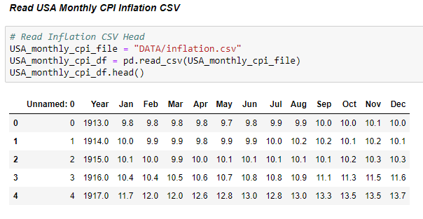
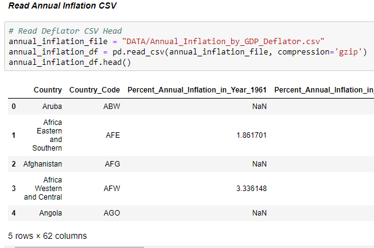
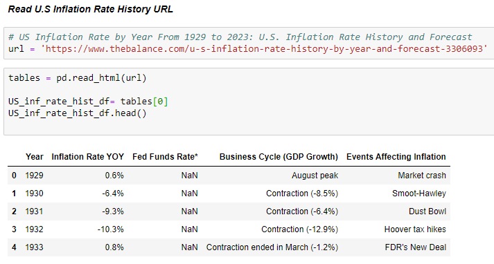
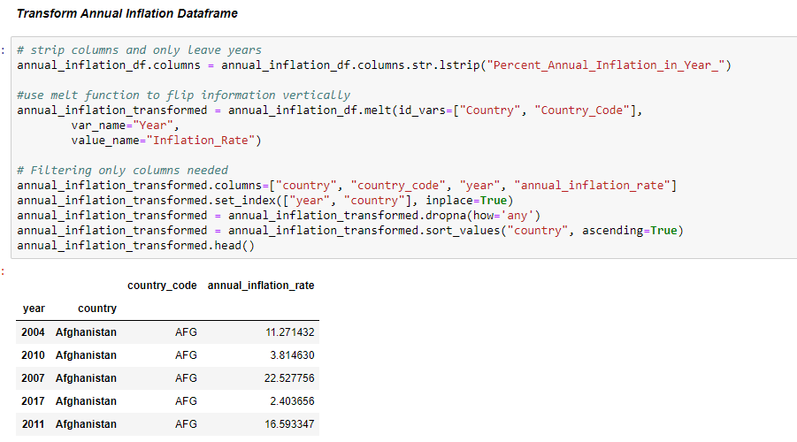
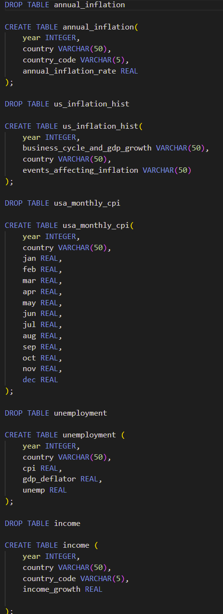
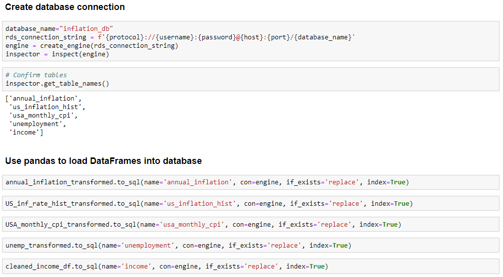
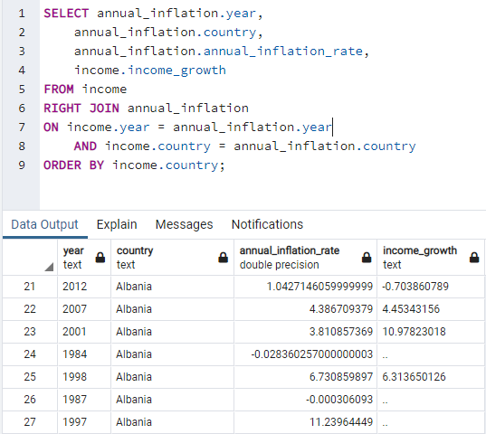
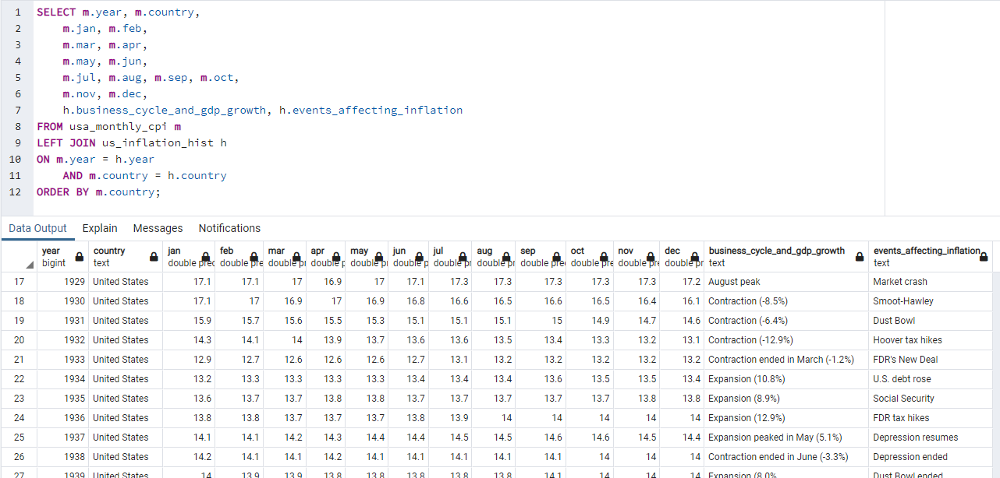
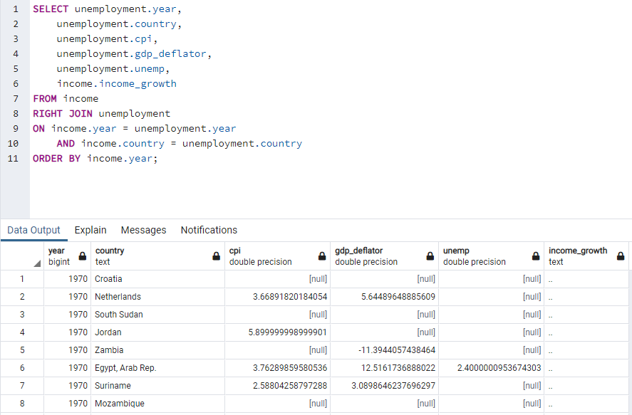

# Project Two Report

# ETL Process

##### Team Members: Estela Perez, Paola Moreno, Ramiro Cervantes

##

## Background
The purpose of our project is to historically analyze global inflation rates and their respective national income and unemployment levels, as well as their relation to major world events. 

## Dependencies
* import pandas as pd
* from sqlalchemy import create_engine
* from sqlalchemy.inspection import inspect
* from config import username, password, host, port, protocol

# ETL PROCESS

## EXTRACT
During the data extraction phase, we exported both structured and unstructured raw data from various source locations to our staging area. 
### Sources

Global Annual Inflation Dataset
Source: Data.World
(https://data.world/johnsnowlabs/annual-inflation-by-gdp-deflator)

U.S. Inflation History Dataset
Source: These data were scraped from The Balance’s article, “US Inflation Rate by Year From 1929 to 2023”
(https://www.thebalance.com/u-s-inflation-rate-history-by-year-and-forecast-3306093)

U.S. Monthly CPI Dataset
Source: Kaggle
(https://www.kaggle.com/datasets/neelgajare/usa-cpi-inflation-from-19132022)

Unemployment Dataset
Source: Kaggle
(https://www.kaggle.com/datasets/prasertk/inflation-interest-and-unemployment-rate)

Income Dataset
Source: These data were pulled from the World Bank Databank; Wolrd Development Indicators.
(https://databank.worldbank.org/source/world-development-indicators#)

### Initial Process

In the initial phase we imported dependencies, which allowed us to extract, transform, and load our data into our notebook. We imported “pandas” for extracting the data from CSV files and a website into data frames with read function, for transforming and cleaning it. From SQLAlchemy we imported functions such as “create-engine” and “inspect”, which connected our notebook to Postgresql database and its tables, thus allowing us to import clean data into it.

### Reading the CSVs

For most of our datasets, we were able to use a simple pandas.read to load our CSV files into a Jupyter notebook. 
Example below:

 
 #
 Our Annual Inflation CSV, however, was too large to load so we had to use compression and zip to read it in. 

#
For our U.S Inflation Rate History dataset, we used pandas.read_html to scrape the appropriate table from the aforementioned webpage. 

## TRANSFORM
In this phase, we transformed and consolidated our raw data for our intended analytical use. This phase consisted of:
- Filtering, cleansing and de-duplicating the data
- Changing column headers for consistency, editing text strings, and reformatting columns.
- Using pandas.melt to reformat some of our tables to match the schema of the target data warehouse.

Examples below:

## LOAD
### Schema

Once our data frames were cleaned and consolidated, we had the schema we needed to create our database in pgAdmin. We used that schema to ensure appropriate dimensions when creating our tables for each of our original five data frames. 

After using pandas to create our database connection in Jupyter, we loaded each data frame into our database, ensuring to replace instead of append. We confirmed our data had been imported accurately by querying each table in our Jupyter notebook.

## pgAdmin
Finally, back in pgAdmin, we joined the appropriate tables for our intended analytical use. Our original purpose was to historically analyze global inflation rates and their respective national income and unemployment levels, as well as their relation to major world events. 

We joined the income and annual_inflation tables to analyze the historical relationship between inflation rates and income levels, by country.

To take a closer look at the U.S. specifically, we combined the usa_monthly_cpi and us_inflation_hist. This new table gives us insight into the U.S. inflation rate in relation to major world events in the last century. 

Finally, we combined the income and unemployment tables to analyze global inflation rates, gdp deflator indices, income levels and unemployment rates, by country from 1970-2021 (see below).

  
